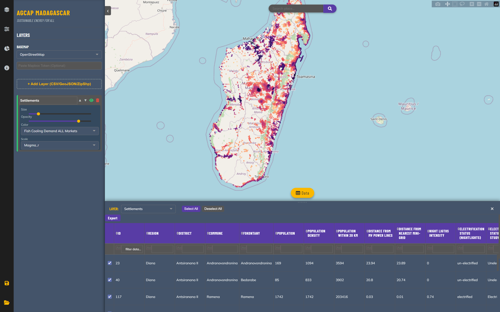

# ❄️AgCAP: Agricultural Cold Chain Access Planning Tool **Madagascar**


## 🌟 Overview

Overview

## 🚀 Getting Started

These instructions will get you a copy of the project up and running on your local machine for development and testing purposes.

### Prerequisites

You need the following installed:

* Python (3.13 or higher). It is recommended installing it via the Miniforge distribution: https://github.com/conda-forge/miniforge
* Conda oand Mamba (for environment management). They come already installed in the Miniforge distribution

### Installation

1.  **Clone the Repository:**
    ```bash
    git clone https://github.com/SEforALL-IEAP/AgCAP.git
    cd [Project Name]
    ```

2.  **Create and Activate the Environment:**
    Use the provided `environment.yml` file to set up all necessary libraries (Pandas, Matplotlib, etc.):
    ```bash
    mamba env create -f environment.yml
    conda activate agcapenv
    ```

## 📚 Project Structure

The project is organized as follows: (DRAFT)
```
AgCAP_project_folder
├───assets
│   └───images
├───data
│   ├───processed
│   │   ├───archive
│   │   ├───input_analyzed
│   │   ├───input_extracted
│   │   └───input_voronoi
│   ├───raw
│   │   ├───admin
│   │   │   ├───adm0
│   │   │   │   └───input_file
│   │   │   ├───adm1
│   │   │   │   └───input_file
│   │   │   ├───adm2
│   │   │   │   └───input_file
│   │   │   ├───adm3
│   │   │   │   └───input_file
│   │   │   └───adm4
│   │   │       └───input_file
│   │   ├───aridity_index
│   │   │   └───input_file
│   │   ├───clim_class
│   │   │   └───input_file
│   │   ├───conflict
│   │   │   └───input_file
│   │   ├───cropland
│   │   │   └───input_file
│   │   ├───crop_prod_spam
│   │   │   └───input_file
│   │   ├───cyclone_hazard
│   │   │   └───input_file
│   │   ├───diurn_range
│   │   │   └───input_file
│   │   ├───elevation
│   │   │   └───input_file
│   │   ├───food_security
│   │   │   └───input_file
│   │   ├───hot_days_30
│   │   │   └───input_file
│   │   ├───iep_elec_results
│   │   │   └───input_file
│   │   ├───livelihood_zones
│   │   │   └───input_file
│   │   ├───mini_grids
│   │   │   └───input_file
│   │   ├───mv_lines
│   │   │   └───input_file
│   │   ├───nightlight
│   │   │   └───input_file
│   │   ├───population
│   │   │   └───input_file
│   │   ├───precipitation
│   │   │   └───input_file
│   │   ├───pvout
│   │   │   └───input_file
│   │   ├───relative_humidity
│   │   │   └───input_file
│   │   ├───rwi
│   │   │   └───input_file
│   │   ├───settlements
│   │   │   └───input_file
│   │   ├───shoreline
│   │   │   └───input_file
│   │   ├───temperature
│   │   │   └───input_file
│   │   ├───t_time
│   │   │   ├───input_air
│   │   │   ├───input_capital
│   │   │   ├───input_cities
│   │   │   ├───input_ports
│   │   │   └───input_railways
│   │   └───w_occ
│   │       └───input_file
│   └───temp
├───docs
├───notebooks
│   └───.ipynb_checkpoints
├───outputs
│   ├───data
│   └───maps
├───scripts
│   ├───aux_scripts
│   ├───dev_backups
│   └───__pycache__
└───visualization_platform

```
## 🗺️🔍 Usage for exploratory analysis using pre-compliled results (visualization -> multi-criteria site selection)

### Running the <span style="color:#007bff; font-weight:bold;">AgCAP Explorer</span> interactive platform


- If you want to use the pre-compiled results:
    1. Navigate to the `visualization_platform` directory
    2. Right-click -> Open in Terminal
    3. Run the command ```conda activate agcapenv``` to activate the environment
    4. Run the command ```python visual_app_launcher.py``` to run the app
    5. When a prompt opens up, select the pre-compiled settlement data, which by default should be `data/processed/settles_gdf_MDG_analyzed.gpkg`

- It is also possible to launch the platform from within the notebook`visual_app_launcher.ipynb`. This gives you the possibility to perform some data analysis, calculate custom composite indices, etc. before performing the multi-criteria site selection within the platform. 

The notebook lets you launch the app within the notebook itself or in a browser tab for a better experience.

The settlements data dictionary can be found here:
[View Data Dictionary](docs/settlements_data_dictionary.csv)

---

## 🧑🏽‍💻 Usage for complete analysis (input data download -> cleaning & manipulation -> analysis -> visualization -> multi-criteria site selection)

### 1) Input data collection and preparation
- Download data and pre-process - if needed - as per the [raw_input_data_table](docs/raw_input_data_table.xlsx)<br> 

| Dataset Name                   | Source                                                                                                             | Format             | Coverage                                | Link/Source                                                                                                                                                                                                                                                   | Download and pre-processing needs                                                                                                                                                                                                                                             |
|:-------------------------------|:-------------------------------------------------------------------------------------------------------------------|:-------------------|:----------------------------------------|:--------------------------------------------------------------------------------------------------------------------------------------------------------------------------------------------------------------------------------------------------------------|:------------------------------------------------------------------------------------------------------------------------------------------------------------------------------------------------------------------------------------------------------------------------------|
| Admin Boundaries               | OCHA                                                                                                               | Shapefile (.shp)   | Several low and middle-income countries | [OCHA](https://data.humdata.org/dataset/?dataseries_name=COD+-+Subnational+Administrative+Boundaries)                                                                                                                                                         | Straight save in raw data structure                                                                                                                                                                                                                                           |
| Admin Boundaries (alternative) | GADM                                                                                                               | GeoPackage (.gpkg) | Most countries                          | [GADM](https://gadm.org/download_country.html)                                                                                                                                                                                                                | Straight save in raw data structure                                                                                                                                                                                                                                           |
| Aridity Index                  | Global Aridity Index and Potential Evapo-Transpiration (ET0) Database v3                                           | GeoTIFF (.tif)     | World                                   | [Global Aridity Index and Potential Evapo-Transpiration (ET0) Database v3](https://gee-community-catalog.org/projects/ai0/#paper-citation)                                                                                                                    | Download Global-AI_ET0_v3_annual version; clip global dataset by admin0 boundary                                                                                                                                                                                              |
| Climatic Classification        | Köppen-Geiger Maps                                                                                                 | GeoTIFF (.tif)     | World                                   | [Köppen-Geiger Maps](https://www.gloh2o.org/koppen/)                                                                                                                                                                                                          | Isolate the 1991_2020\koppen_geiger_0p00833333 file; clip global dataset by admin0 boundary                                                                                                                                                                                   |
| Conflict Events                | ACLED                                                                                                              | CSV (.csv)         | World                                   | [ACLED](https://acleddata.com/conflict-data/data-export-tool)                                                                                                                                                                                                 | Register for free -> Data Export Tool -> set date range = last 2 years, location = country of interest, leave the rest as default -> download                                                                                                                                 |
| Cropland Extent                | Global cropland expansion in the 21st century (GLAD / Potapov)                                                     | GeoTIFF (.tif)     | World                                   | [Global cropland expansion in the 21st century (GLAD / Potapov)](https://glad.umd.edu/dataset/croplands)                                                                                                                                                      | For more accurate results, subtract rice fields data (https://zenodo.org/records/13729353) or any othe dominant non-perishable crop from the cropland extent dataset                                                                                                          |
| Cyclone Hazard                 | UNDRR Global Assessment Report (GAR)'s Global model of cyclone wind 50, 100, 250, 500 and 1000 years return period | GeoTIFF (.tif)     | World                                   | [UNDRR Global Assessment Report (GAR)'s Global model of cyclone wind 50, 100, 250, 500 and 1000 years return period](https://data.humdata.org/dataset/cyclone-wind-100-years-return-period?)                                                                  | nan                                                                                                                                                                                                                                                                           |
| Diurnal Range (Temp)           | WorldClim BIO Clim Variables                                                                                       | GeoTIFF (.tif)     | World                                   | [WorldClim BIO Clim Variables](https://www.worldclim.org/data/worldclim21.html)                                                                                                                                                                               | Download the whole 10 Gb "bio 30s" zipped file from the link provided or use Google Earth Engine to download only the required variable and for the required geography https://developers.google.com/earth-engine/datasets/catalog/WORLDCLIM_V1_BIO [GEE CODE TO BE PROVIDED] |
| Elevation                      | Copernicus Digital Elevation Model (GLO-30 DEM)                                                                    | GeoTIFF (.tif)     | World                                   | [Copernicus Digital Elevation Model (GLO-30 DEM)](https://gee-community-catalog.org/projects/glo30/)                                                                                                                                                          | Either download from Google Earth Engine (CODE TO BE PROVIDED) or download the  NASA (SRTM 1 Arc-Second Global) using the SRTM Downloader Plugin within QGIS                                                                                                                  |
| Food Security                  | Integrated Food Security Phase Classification (IPC)                                                                | GeoJSON (.geojson) | Selected food-insecure countries        | [Integrated Food Security Phase Classification (IPC)](https://www.ipcinfo.org/ipc-country-analysis/ipc-mapping-tool/)                                                                                                                                         | Click on the country on the map -> select the latest Acute Food Insecurity Analysis -> download GIS format                                                                                                                                                                    |
| Hot Days (hd30)                | Calculation based on ERA5-Land Daily Aggregated                                                                    | GeoTIFF (.tif)     | World                                   | [Calculation based on ERA5-Land Daily Aggregated](https://developers.google.com/earth-engine/datasets/catalog/ECMWF_ERA5_LAND_DAILY_AGGR)                                                                                                                     | Google Earth Engine script provided [TO BE PROVIDED]                                                                                                                                                                                                                          |
| Relative Humidity (hurs)       | CIMIP6 from World Bank Climate Change Knowledge Portal (CCKP)                                                      | GeoTIFF (.tif)     | World                                   | [CIMIP6 from World Bank Climate Change Knowledge Portal (CCKP)](https://wbg-cckp.s3.amazonaws.com/data/cmip6-x0.25/hd30/ensemble-all-historical/climatology-hd30-annual-mean_cmip6-x0.25_ensemble-all-historical_climatology_median_1995-2014.nc)             | Convert .nc file into raster TIF file                                                                                                                                                                                                                                         |
| Electrification Status (IEP)   | Integrated Electrification Planning Results, from Government stakeholders                                          | GeoPackage (.gpkg) | Country-specific                        | [Integrated Electrification Planning Results, from Government stakeholders](Depending on country)                                                                                                                                                             | nan                                                                                                                                                                                                                                                                           |
| Livelihood Zones               | FEWS NETLivelihood Zones                                                                                           | Shapefile (.shp)   | nan                                     | [FEWS NETLivelihood Zones](https://fews.net/data/livelihood-zones)                                                                                                                                                                                            | nan                                                                                                                                                                                                                                                                           |
| Mini-Grids                     | Mini-grid location from Government stakeholders                                                                    | Any vector format  | Country-specific                        | [Mini-grid location from Government stakeholders](Not publicly available)                                                                                                                                                                                     | nan                                                                                                                                                                                                                                                                           |
| MV Lines                       | Medium Voltage (MV) Electrical Lines from Government stakeholders                                                  | Any vector format  | Country-specific                        | [Medium Voltage (MV) Electrical Lines from Government stakeholders](Not publicly available)                                                                                                                                                                   | nan                                                                                                                                                                                                                                                                           |
| Nightlight                     | VIIRS/NPP Visible Infrared Imaging Radiometer Suite                                                                | GeoTIFF (.tif)     | World                                   | [VIIRS/NPP Visible Infrared Imaging Radiometer Suite](https://eogdata.mines.edu/products/vnl/.)                                                                                                                                                               | Download the latest available Monthly Cloud-free DNB Composite, Median.                                                                                                                                                                                                       |
| Population                     | WorldPop's constrained Individual Countries 2015-2030 100m resolution                                              | GeoTIFF (.tif)     | World                                   | [WorldPop's constrained Individual Countries 2015-2030 100m resolution](https://hub.worldpop.org/geodata/listing?id=100)                                                                                                                                      | nan                                                                                                                                                                                                                                                                           |
| Precipitation                  | WorldClim BIO Variables                                                                                            | GeoTIFF (.tif)     | World                                   | [WorldClim BIO Variables](https://www.worldclim.org/data/worldclim21.html)                                                                                                                                                                                    | Download the whole 10 Gb "bio 30s" zipped file from the link provided or use Google Earth Engine to download only the required variable and for the required geography https://developers.google.com/earth-engine/datasets/catalog/WORLDCLIM_V1_BIO [GEE CODE TO BE PROVIDED] |
| PV Output (pvout)              | Global Solar Atlas's Specific solar photovoltaic (PV) output                                                       | GeoTIFF (.tif)     | World                                   | [Global Solar Atlas's Specific solar photovoltaic (PV) output](https://globalsolaratlas.info/download)                                                                                                                                                        | nan                                                                                                                                                                                                                                                                           |
| Relative Wealth Index (rwi)    | Meta's Relative Wealth Index Map                                                                                   | GeoTIFF (.tif)     | 93 low and middle-income countries      | [Meta's Relative Wealth Index Map](https://data.humdata.org/dataset/relative-wealth-index?fbclid=IwZXh0bgNhZW0CMTEAYnJpZBExMHp4QTY3ellmaFg2c0dER3NydGMGYXBwX2lkATAAAR5CYAQfvmSSPSh2JLrDT8sebiJEC1jmH-9_HB05sAcSi8fQx947oY87GUzyig_aem_l0P1tM-UMYF3heZ2Fp419A) | nan                                                                                                                                                                                                                                                                           |
| Settlements                    | GRID3 Settlement Extents                                                                                           | GeoPackage (.gpkg) | Sub-Saharan Africa                      | [GRID3 Settlement Extents](https://data.grid3.org/search?tags=settlements)                                                                                                                                                                                    | Customized population clusters can be used with a few tweaks on the code                                                                                                                                                                                                      |
| Shoreline                      | OpenStreetMap (OSM) Coastline                                                                                      | GeoPackage (.gpkg) | World                                   | [OpenStreetMap (OSM) Coastline](https://osmdata.openstreetmap.de/data/coastlines.html)                                                                                                                                                                        | To download only the specific country's coastlines, use the QuickOSM Plugin within QGIS                                                                                                                                                                                       |
| Travel Times                   | Travel times to Airports, Ports, Capital, Cities, Railways                                                         | GeoTIFF (.tif)     | World                                   | [Travel times to Airports, Ports, Capital, Cities, Railways](https://malariaatlas.org/project-resources/accessibility-to-healthcare/)                                                                                                                         | Generated by the auxiliary tool provided, starting from CSV files (one for each POI, having only 2 columns: X_COORD, Y_COORD). Based on https://malariaatlas.org/project-resources/accessibility-to-healthcare/                                                               |
| Temperature (Annual Avg)       | Global Solar Atlas's Mean Temperature                                                                              | GeoTIFF (.tif)     | World                                   | [Global Solar Atlas's Mean Temperature](https://globalsolaratlas.info/download)                                                                                                                                                                               | nan                                                                                                                                                                                                                                                                           |
| Water Occurance                | JRC Global Surface Water (GSW)                                                                                     | GeoTIFF (.tif)     | World                                   | [JRC Global Surface Water (GSW)](https://developers.google.com/earth-engine/datasets/catalog/JRC_GSW1_4_GlobalSurfaceWater)                                                                                                                                   | Google Earth Engine to download only the required variable and for the required geography [GEE CODE TO BE PROVIDED]                                                                                                                                                           |

- Save the raw input files into the sub-directories `data/raw/[data type]/input_file`

### 2) Running the <span style="color:#28a745; font-weight:bold;">Data Extraction Notebook</span> <br>
- Make sure that the raw data sub-directories are all fileld with a single input data file
- Run the [Data Extraction Notebook](notebooks/data_extraction.ipynb) , saving the output files in the `data/processed` directory

### 3) Running the <span style="color:#ffc107; font-weight:bold;">Analysis Notebook</span>
- Make sure that the extracted settlement dataset generated by the extraction notebook is saved in the `data/processed/input_extracted`
- Run the [Core Analysis Notebook](notebooks/core_analysis_engine.ipynb), saving the output files in the `data\processed\input_analyzed` directory
- Launch the visualization platform from within the notebook, which allows to perform the multi-criteria site selection and general exploration of the results

### 4) Running the <span style="color:#007bff; font-weight:bold;">AgCAP Explorer</span> interactive platform
- Although the visualization platform can be launched from within the last section of the [Core Analysis Notebook](notebooks/core_analysis_engine.ipynb), it is also possible to launch the platform without running the previous notebooks, in two ways:
    - A) Open the [Visual App Launcher Notebook](notebooks/visual_app_launcher.ipynb) notebook and run all cells to perform the data analysis and generate output plots, OR:
    - B) Run the [Visual App Launcher](visualization_platform/visual_app_launcher.py) directly from Terminal. Navigate to the `visualization_platform` directory, open the Terminal and run:
        ```bash
        python visual_app_launcher.py
        ```
    This will open up the browser with the interactive visualization platform


## 🗺️ AgCAP Expore Interactive Platform
- ..
- ...

## 🤝 Contact
[Davide Mazzoni](https://github.com/orgs/SEforALL-IEAP/people/davidemazzoni2) - davidem@unops.org

Robbert Hoeboer - robberth@unops.org

[Alexandros Korkovelos](https://github.com/akorkovelos) - alexandrosk@unops.org 

## ⚖️ License

This project is licensed under the **GNU Affero General Public License v3.0**.
See the [LICENSE](LICENSE) file for details.
